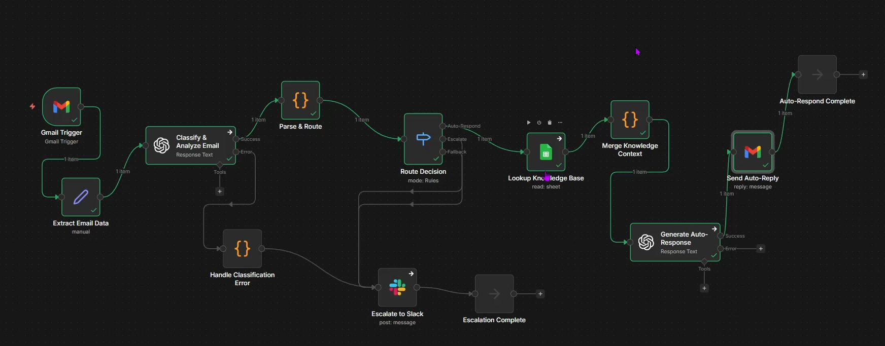

# AI Customer Support Agent (n8n Workflow)

An intelligent workflow that classifies support emails using GPT-4o, auto-responds with knowledge-base-backed answers, and escalates complex issues to Slack.

## What It Does

Email received → AI classifies (category, sentiment, urgency, complexity)
↓
┌───────────────┴───────────────┐
↓                               ↓
Simple request                  Complex/Urgent/Negative
↓                               ↓
Lookup knowledge base           Escalate to Slack
↓                          (no auto-reply)
Generate response
↓
Send auto-reply

## Features

- **Smart Classification**: Category, sentiment, urgency, and complexity analysis
- **Knowledge Base RAG**: Pulls relevant FAQs from Google Sheets
- **Intelligent Routing**: Auto-responds to simple queries, escalates the rest
- **Error Handling**: Classification failures auto-escalate for safety
- **Rich Slack Alerts**: Full context for human follow-up

## Tech Stack

| Tool | Purpose |
|------|---------|
| n8n | Workflow automation |
| OpenAI GPT-4o | Classification + response generation |
| Google Sheets | Knowledge base |
| Gmail | Email trigger + replies |
| Slack | Escalation notifications |

## Quick Start

1. Import `workflow/customer-support-agent.json` into n8n
2. Set up credentials (Gmail, OpenAI, Google Sheets, Slack)
3. Create Google Sheet from `templates/knowledge-base.csv`
4. Update `[Company Name]` in the response generation prompt
5. Activate workflow

## Credentials Required

| Credential | How to Get |
|------------|------------|
| Gmail OAuth2 | n8n OAuth flow |
| OpenAI API | [platform.openai.com](https://platform.openai.com) |
| Google Sheets OAuth2 | n8n OAuth flow |
| Slack OAuth2 | [Create Slack App](https://api.slack.com/apps) |

## Knowledge Base Setup

Import `templates/knowledge-base.csv` into Google Sheets with columns:

| Category | Question | Answer |
|----------|----------|--------|
| Billing | How do I get a refund? | Refunds are processed within 5-7 days... |

## Escalation Criteria

Auto-escalates when ANY of these are true:
- Sentiment: Negative
- Urgency: High or Urgent
- Complexity: Complex
- Category: Complaint
- Keywords: cancel, lawyer, legal, refund

## Demo
[\[Link to your video\]](https://youtu.be/ogwLsnAbX6k)

## Cost

~$0.01 per email (OpenAI API usage)

## License

MIT - Use it, modify it, share it.

## Author

**Your Name**
- [LinkedIn](https://www.linkedin.com/in/amna-mahmood-70715149/)
- [Twitter](https://x.com/AmahmoodMahmood)

---

⭐ Star this repo if you found it useful!